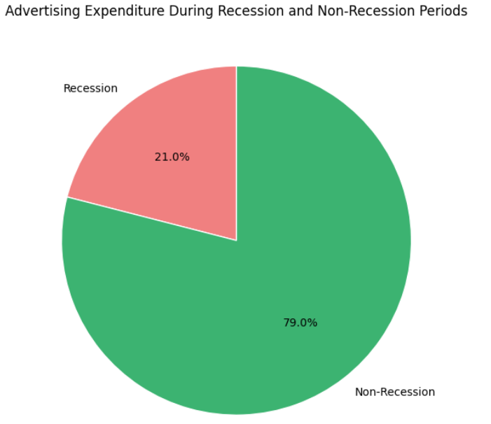
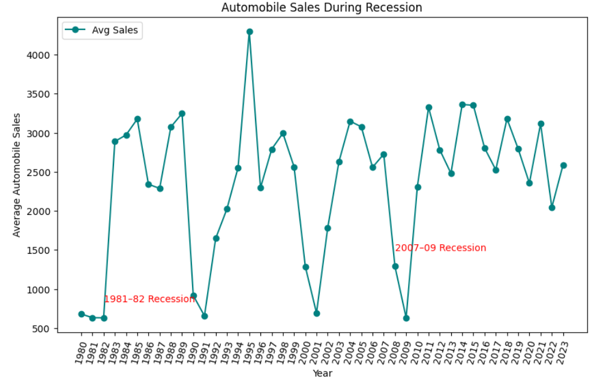
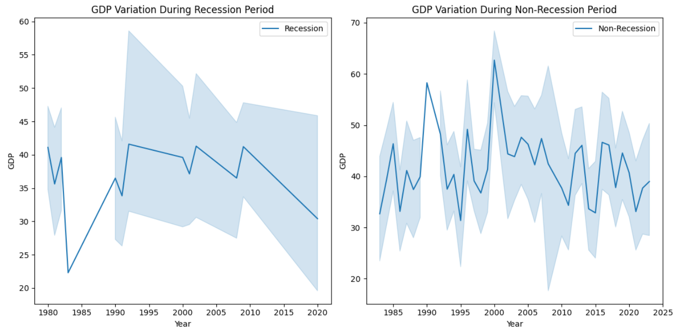
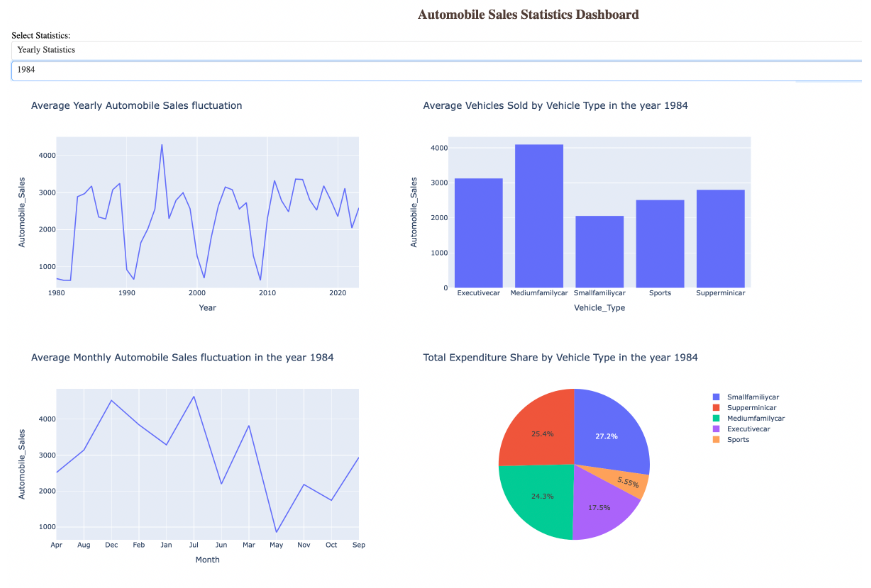

# 🚗 Economic Impact on Automobile Sales Analysis 

An interactive dashboard built with Dash and Plotly to analyze historical automobile sales trends from 1980 to 2013, with a focus on recession periods. This project is part of a two-part data visualization portfolio that combines exploratory analysis with interactive web-based insights.

---

## 📊 Features

- 📈 Yearly and monthly automobile sales trends
- 📉 Recession impact analysis on vehicle sales
- 🚘 Vehicle type breakdowns and comparisons
- 💰 Advertising expenditure insights
- 📊 Interactive dropdowns and dynamic charts
- 🧠 Callback logic for responsive UI behavior

---

## 📁 Project Structure
economic-impact-on-automobile-sales-analysis/
```
├── data/
│   └── data_source.md # Dataset URL and schema 
├── images/ │  
│   └── advertising_expenditure_during_recession_and_non_recession_pie_chart1.png │   
│   └── share_of_each_vehicle_type_in_total_expenditure_during_recession_pie_chart2.png │   
│   └── automobile_sales_during_recession_line_plot1.png │   
│   └── automobile_sales_by_vehicle_type_during_recession_line_plot2.png │
│   └── normalized_automobile_sales_by_vehicle_type_during_recession_line_plot3
│   └── relationship_between_Avg_vehicle_price_and_sales_during_recessions
│   └── seasonality_impact_on_automobile_sales_bubble_chart
│   └── Subplot_GDP_variation_during_recession_and_non_recession
│   └── vehicle_sales_during_recession_and_non_recession_bar_chart
│   └── automobile_sales_statistics_dashboard_Recession_period_Statistics.png │   
│   └── automobile_sales_statistics_dashboard_Yearly_Statistics.png 
├── notebook/ │   
│   └── exploratory_analysis_and_visuals.ipynb # Exploratory analysis with Matplotlib, Seaborn, Folium 
├── app/ │   
│   └── ainteractive_dashboard.py # Dash app with interactive components 
├── README.md # Project overview and setup guide 
├── LICENSE    
└── .gitignore # Ignore virtual env, cache, etc. 
```
---

## 📄 Dataset

- **Source**: [Historical Automobile Sales CSV](https://cf-courses-data.s3.us.cloud-object-storage.appdomain.cloud/IBMDeveloperSkillsNetwork-DV0101EN-SkillsNetwork/Data%20Files/historical_automobile_sales.csv)
- **Time Range**: 1980–2023
- **Key Variables**:
  - `Automobile_Sales`, `Recession`, `GDP`, `unemployment_rate`, `Consumer_Confidence`
  - `Vehicle_Type`, `Advertising_Expenditure`, `Competition`, `Price`, `Date`, `Month`, `Year`

See [`data/data_source.md`](data/data_source.md) for full details.

---

## 🛠️ Technologies Used

- Python
- Dash & Plotly
- Pandas
- Matplotlib, Seaborn, Folium
- Jupyter Notebook

---

## Visualizations









---

## Insights
- Recession periods significantly reduce automobile sales, with average yearly sales dropping compared to non-recession years—highlighting the sensitivity of consumer spending to economic downturns.
- Executive and sports cars experience the steepest decline during recessions, while supermini and small family cars maintain more stable sales—suggesting a shift toward affordability in tough times.
- Advertising expenditure remains high even during recessions, but its effectiveness varies by vehicle type—indicating that marketing strategies may need to be more targeted during economic slumps.
- Unemployment rate has a strong inverse correlation with automobile sales, especially for higher-end vehicle types—reinforcing the link between job security and big-ticket purchases.
- Seasonal trends persist across years, with spikes in sales during spring and fall months—suggesting that timing promotions around these periods could optimize revenue regardless of economic conditions.

---

## 📜 License

This project is licensed under the 
[Creative Commons BY-NC-ND 4.0](https://creativecommons.org/licenses/by-nc-nd/4.0/)

You may view and learn from the content, but **you may not reuse, redistribute, or modify it** for commercial or derivative purposes without permission.

---

## 💬 Contact

Feel free to connect with me on [LinkedIn](https://linkedin.com/in/sidney-dang) or email at kyledang2711@gmail.com if you'd like to discuss this project or any opportunities.
